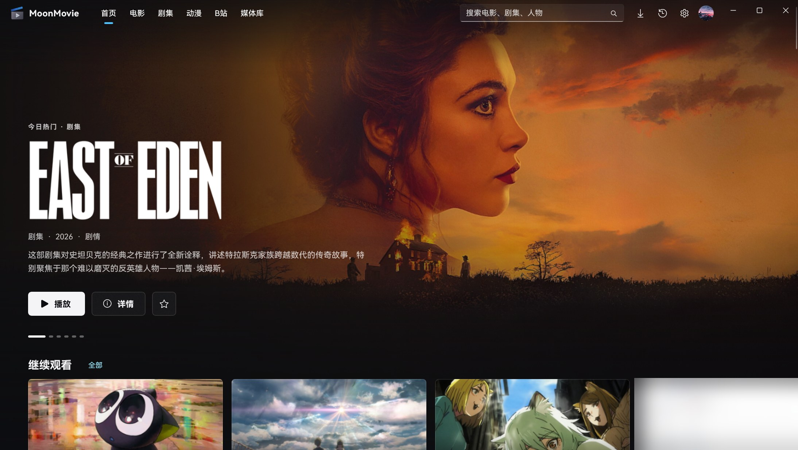
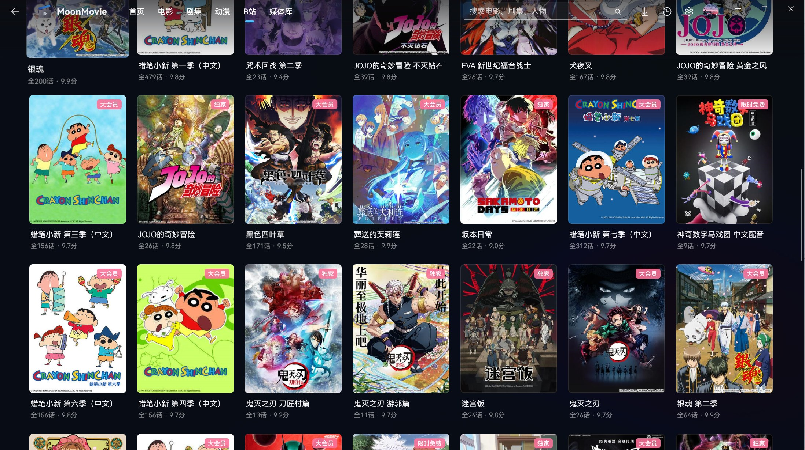
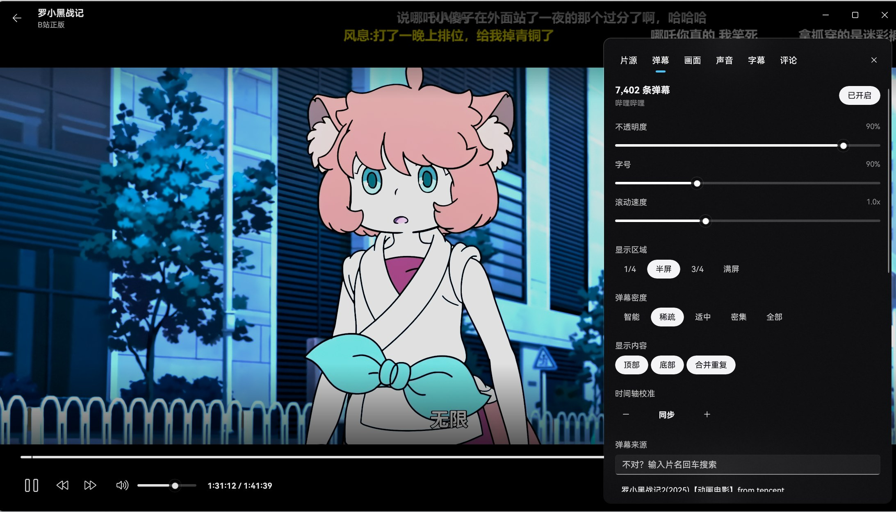

<p align="center">
  
</p>

<h1 align="center">MoonMovie</h1>

<p align="center">
  Windows 上的影视聚合与本地播放器 · WinUI 3 / .NET 10 · mpv 内核<br/>
  Android 版 CineNest 的桌面版本
</p>

<p align="center">
  <a href="https://github.com/YilianFengyue/MoonMovie/releases/latest"></a>
  
  
</p>



| B站正版片库 | 播放器与弹幕 |
| --- | --- |
|  |  |

## 功能

**找片**
- TMDB 的海报、简介、演职员和剧集资料；电影 / 剧集 / 动漫分类浏览，搜索、收藏、继续观看
- 豆瓣评分；详情页附带 B站 相关视频（解说、混剪、二创）

**片源**
- 自动在资源站检索、测速、挑最快的，播放失败自动换源，去掉插播广告
- **B站正版**作为片源：番剧、国创、电影、纪录片按季和配音版本匹配；大会员内容在没有大会员时自动换用其他片源
- 本地文件优先：媒体库里有的集直接播本地

**播放器**
- mpv（libmpv）内核：硬件解码、HDR、ASS 特效字幕、双字幕、音轨与音画同步、截图、逐帧、A-B 循环
- 超分辨率：Anime4K（流畅 / 高质量 / 低清增强），N 卡 RTX 视频超分
- 跳过片头片尾（B站正版自带片头片尾标记），自动下一集，画中画
- 弹幕：B站 原生弹幕池或 LogVar 弹幕服务器；智能密度、屏蔽词、合并重复

**B站**
- 「B站」频道：新番时间表、正版片库（B站 自己的筛选和排序）、热门与排行榜
- 扫码关联账号：1080P / 大会员画质、观看进度和追番进度同步到 B站、全部评论与回复、我的追番 / 稍后再看 / 收藏夹
- 登录信息保存在 Windows 凭据管理器里，到期前自动续期

**本地与离线**
- 打开或拖入文件；本地媒体库自动扫描、识别片名并匹配 TMDB，和在线片源共用进度与详情页
- 离线下载：单集或整季，去广告、断点续传、限速，下完进本地媒体库，完成时系统通知

**系统集成**
- Fluent 设计：Mica、亚克力、个人主页与头像、标准设置卡片
- 媒体浮层与媒体键、任务栏缩略图按钮与进度、跳转列表、视频文件关联、应用内自动更新

## 安装

1. 在 [Releases](https://github.com/YilianFengyue/MoonMovie/releases/latest) 下载 `MoonMovie-x.y.z-x64-安装包.zip`，**先解压**。
2. 双击 **「安装 MoonMovie.cmd」**，同意一次管理员权限。脚本会信任随包附带的自签名证书，然后安装 MoonMovie。
3. 以后有新版本时，MoonMovie 会在标题栏下方提示，点「立即更新」即可；也可以手动下载新的安装包，再双击一次。

> Windows 可能提示「Windows 已保护你的电脑」：点「更多信息」→「仍要运行」。安装包来自本仓库的 Release，证书只用于给 MoonMovie 签名。

## 第一次使用：配置你自己的密钥

Release 里的安装包**不内置任何密钥**，需要自己配置（都免费）：

| 配置 | 必需 | 在哪里填 | 说明 |
| --- | --- | --- | --- |
| TMDB 密钥 | 是 | 第一次打开会自动跳到「设置 → 服务」 | 在 [themoviedb.org](https://www.themoviedb.org/settings/api) 免费申请，API Key 或 Read Access Token 均可，填好后重启 |
| 弹幕服务器 | 否 | 设置 → 服务 → 弹幕服务器 | 自建的 LogVar 弹幕 API（danmu_api）地址和令牌；不填也能看 B站 视频和 B站正版的原生弹幕 |
| B站 账号 | 否 | 右上角头像 → 个人主页 → 扫码关联 | 解锁 1080P / 大会员画质、进度同步、全部评论 |

不需要开代理：MoonMovie 内置了国内可以直连的 TMDB 反代，和官方接口同时尝试、自动用最快的那个；开着 Clash 等系统代理也照常工作。资源站和 B站 始终直连。

## 从源码构建

需要 Windows 10 2004+、.NET 10 SDK 和 7-Zip。

```powershell
.\build\get-libmpv.ps1            # 下载固定版本的 libmpv 到 lib\mpv
copy .env.example .env            # 可选：填上 TMDB 密钥等，开发时免得每次手动输入
dotnet build src\MoonMovie\MoonMovie.csproj -p:Platform=x64
```

发布：

```powershell
.\build\new-cert.ps1 -Password <密码>     # 只需一次：生成签名证书（build\cert，不进 git）
.\build\package.ps1 -Version 1.3.0      # 输出 artifacts\release\：安装包、便携版和单独的 .msix
python .\build\make-icons.py            # 换了 docs\logo.png 之后重新生成所有图标
```

> `package.ps1` 会把仓库根目录的 `.env` 一起打进安装包。**公开发布前请先移走 `.env`**，否则密钥会随包分发。

推送 `v*` 标签后，GitHub Actions 会自动打包并发布到 Releases，需要在仓库 Secrets 里配置 `SIGNING_PFX_BASE64` 和 `SIGNING_PFX_PASSWORD`。`TMDB_API_KEY`、`LOGVAR_BASE_URL`、`LOGVAR_TOKEN` 可选，配置后会内置到安装包里，任何拿到安装包的人都能读出来。

## 许可与声明

MoonMovie 以 [GPL-3.0](LICENSE) 开源（因为使用了 GPL 许可的 libmpv）。

- [mpv / libmpv](https://mpv.io)：GPL-2.0+；构建来自 [shinchiro/mpv-winbuild-cmake](https://github.com/shinchiro/mpv-winbuild-cmake)
- [Anime4K](https://github.com/bloc97/Anime4K)：MIT（`src/MoonMovie/Assets/Shaders/LICENSE-Anime4K.txt`）
- [Windows Community Toolkit](https://github.com/CommunityToolkit/Windows)：MIT
- HarmonyOS Sans 字体：遵循其官方字体许可
- 影视资料与图片来自 [TMDB](https://www.themoviedb.org)。本产品使用 TMDB API，但未经 TMDB 认可或认证。

片源来自公开的资源站，MoonMovie 不存储、不提供任何影视内容。B站 内容通过你自己的账号观看，版权归 B站 及其权利方所有。本项目仅供个人学习与交流使用。
